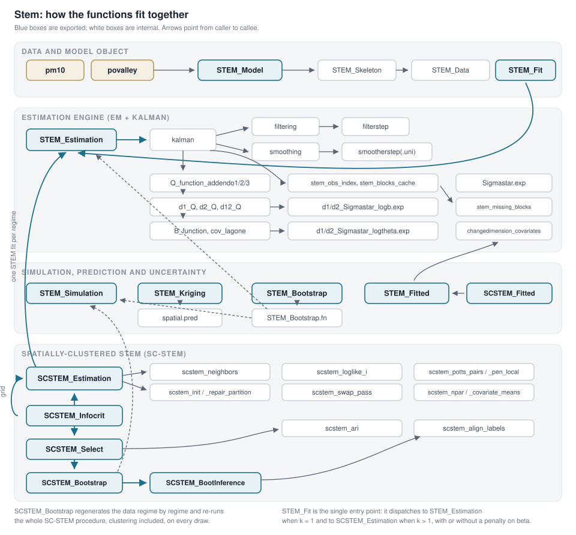

# How the functions fit together

[Back to the README](../README.md) | [All pages](README.md)

A map of the package, from the data to the spatially-clustered layer.

Blue boxes are exported functions, white boxes internal ones; arrows point from caller to callee. The complete edge list, obtained by parsing the sources, is in [`inst/extdata/STEM_function_map.md`](../inst/extdata/STEM_function_map.md); the narrative version is the vignette `function-map`, and the PDF of the map is [`inst/extdata/STEM_function_map.pdf`](../inst/extdata/STEM_function_map.pdf). Both images are generated by [`inst/scripts/make-function-map.R`](../inst/scripts/make-function-map.R).

Three things are worth noticing.

1. **The SC-STEM layer is a client of the STEM layer.** `SCSTEM_Estimation()` builds one `STEM_Model` per regime and calls `STEM_Estimation()` on it: anything that improves the engine improves the clustered models for free.
2. **The engine is split by role.** `STEM_Estimation()` hands the fit to `stem_em_fit()`, which runs the iterations of the algorithm chosen in `STEM_control()`, plain or accelerated by SQUAREM. An iteration is an E-step (`stem_estep()`, which rests on the Kalman filter and smoother of `kalman()`) and an M-step (`stem_mstep_em()` or `stem_mstep_ecme()`).
3. **`STEM_Simulation()` is the hinge of both bootstraps**, and the selection layer is stateless: `SCSTEM_Select()` never refits.

---

[Back to the README](../README.md) | [All pages](README.md)
